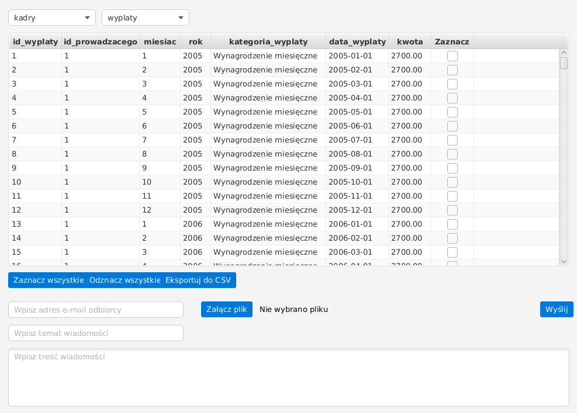

# 📊 DataBaseMail


**Przeglądarka baz danych PostgreSQL w JavaFX** z nawigacją po schematach i tabelach, możliwością eksportu do CSV oraz wbudowanym modułem wysyłania maili.



Aplikacja umożliwia intuicyjny wybór schematu i tabeli z bazy PostgreSQL, a następnie dynamiczne wyświetlanie danych w `TableView` (kolumny generowane są automatycznie na podstawie metadanych). Dodatkowo z poziomu interfejsu możesz wysłać wybrane dane e-mailem, również z załącznikiem.

---

## ✨ Funkcje

- **Przegląd schematów i tabel** – automatyczne pobieranie i listowanie dostępnych struktur z bazy
- **Dynamiczny podgląd danych** – wyświetlanie zawartości tabeli w interaktywnym widoku `TableView`
- **Eksport do CSV** – możliwość zaznaczenia wybranych wierszy (checkboxy) i zrzucenia ich do pliku CSV
- **Wysyłanie e-maili** – wbudowany klient SMTP z obsługą załączników
- **Stałe połączenie JDBC** – optymalne zarządzanie połączeniem z bazą PostgreSQL
- **Bezpieczna konfiguracja** – wrażliwe dane (hasła, loginy) przechowywane w pliku `.env`

---

## 🧰 Technologie i narzędzia

- **Java 11+**
- **JavaFX** – GUI
- **PostgreSQL & JDBC** – baza danych i sterownik
- **JavaMail API** – obsługa protokołu SMTP
- **dotenv-java** – bezpieczne wczytywanie zmiennych środowiskowych
- **Maven** – zarządzanie zależnościami i budowanie projektu

---

## ✅ Wymagania

- JDK **11** lub nowsze
- PostgreSQL (lokalnie lub zdalnie)
- Maven

---

## 🔐 Konfiguracja (plik `.env`)

Aplikacja wczytuje dane dostępowe z pliku `.env`. **Plik ten powinien być ignorowany przez Gita i nie może trafić do publicznego repozytorium.**

### 1) Dodaj zależność dotenv do `pom.xml`

```xml
<dependency>
  <groupId>io.github.cdimascio</groupId>
  <artifactId>dotenv-java</artifactId>
  <version>3.0.0</version>
</dependency>
```

### 2) Utwórz plik `.env` w głównym katalogu projektu

Utwórz plik `.env` i uzupełnij danymi:

```env
DB_URL=jdbc:postgresql://HOST:5432/DB_NAME
DB_USER=twoj_uzytkownik_bazy
DB_PASS=twoje_haslo_do_bazy

MAIL_USER=twoj.email@gmail.com
MAIL_PASS=twoje_haslo_aplikacji
```

**Wskazówka:** `MAIL_PASS` to tzw. *hasło aplikacji* (np. wygenerowane w ustawieniach bezpieczeństwa konta Google), a nie Twoje główne hasło do poczty.

### 3) Zabezpiecz `.env` w `.gitignore`

W pliku `.gitignore` dopisz:

```gitignore
# Zmienne środowiskowe
.env
```

> Jeśli w przeszłości hasła były commitowane w kodzie, samo usunięcie ich teraz nie usuwa ich z historii Gita — trzeba je potraktować jako wyciek i zmienić.

---

## ▶️ Uruchamianie

Uruchom aplikację za pomocą pluginu JavaFX w Maven:

```bash
mvn clean javafx:run
```

---

## 🧭 Jak korzystać z aplikacji?

1. Po uruchomieniu wybierz **schemat** z pierwszej listy rozwijanej na górze
2. Następnie wybierz **tabelę** z drugiej listy
3. Dane załadują się automatycznie; po prawej stronie każdego wiersza znajduje się checkbox
4. Użyj przycisków na dole, aby:
    - zaznaczyć/odznaczyć wszystkie wiersze
    - wyeksportować wybrane wiersze do pliku `.csv`
5. W dolnej sekcji formularza możesz wpisać adres e-mail, temat, treść, dodać załącznik (np. wygenerowany CSV) i kliknąć **Wyślij**

---

## 👤 Autor

**Kacper Szczudło**  
GitHub: [@kacperszczudlo](https://github.com/kacperszczudlo)

---

⭐ Jeśli projekt okazał się przydatny, zostaw gwiazdkę na GitHubie!